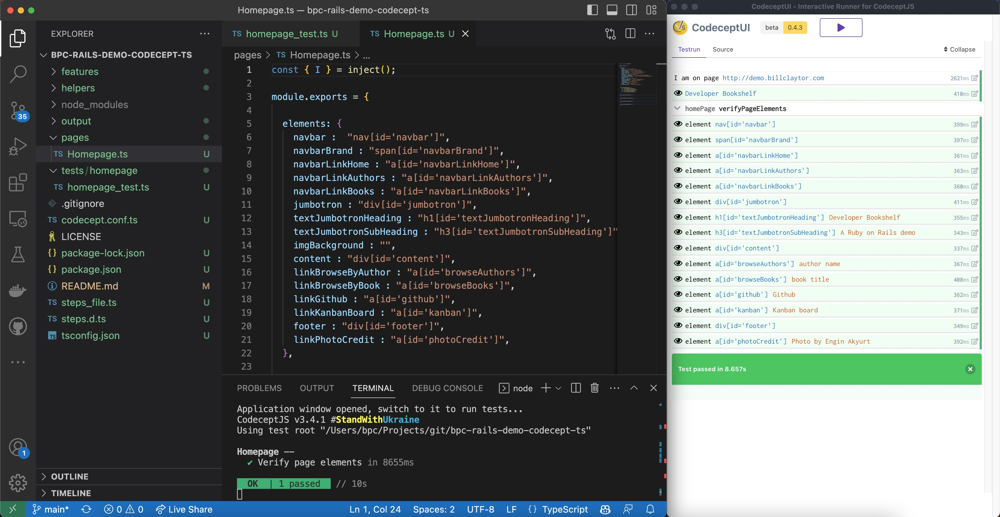

# bpc-rails-demo-codecept-ts
Test automation for the bpc-rails-demo project using CodeceptJS with TypeScript



## Background
This project is a test automation framework for the bpc-rails-demo project. It uses CodeceptJS as the test automation framework and Playwright as the browser automation library.

### CodeceptJS
CodeceptJS is a test automation framework that uses the Page Object Model (POM) design pattern. It is a wrapper around the WebDriver API and provides a simple API for writing tests. It also provides a number of useful features such as parallel execution, data-driven testing, and test retries.

### Playwright
Playwright is a browser automation library that provides a simple API for automating the Chrome, Firefox, and Webkit browsers.

## Getting Started
### Prerequisites
- Node.js

### Installation
1. Clone the repository
2. Install the dependencies
```
npm install
```

### Running the tests without the UI
```
npx codeceptjs run
```

### Running the tests with the UI
```
npm run codeceptjs:ui
```

## License
This project is licensed under the MIT License - see the LICENSE.md file for details

## Acknowledgments
- [CodeceptJS](https://codecept.io/)
- [Playwright](https://playwright.dev/)


